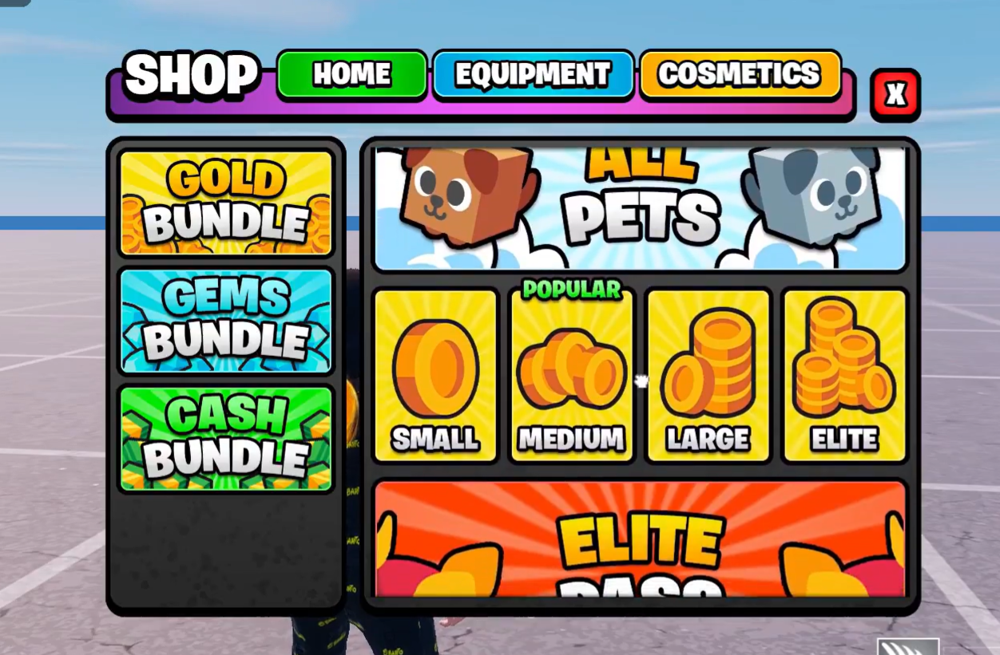

# Escape From Tsunami

## Table of Contents

- [Escape From Tsunami](#escape-from-tsunami)
  - [Table of Contents](#table-of-contents)
  - [Overview](#overview)
  - [Setting up characters](#setting-up-characters)
  - [Setting up collections](#setting-up-collections)
---
## Overview
This is the documentation guide for Delta UEFN's Escape From Tsunami template. Almost everything is handled in Scene Graph, except for a single Verse device used to handle player spawning more effectively. In this setup guide we'll explain how you can customize the template to your liking, and most important of all; set up your own characters.

The main thing to remember is that the Entities -> EP_Game file is the "main" game handler. This is an entity prefab, which means it's different from an entity placed down on the map. If you open this, you'll see the main mechanics of our game, like the live event, different buttons etc. If you want to make changes to the mesh for the keypad button for example, make sure to change it in the Entities -> EP_Keypad prefab, and it will automatically change everywhere. Similarly, if you wnat to make changes to how the slots look, don't change it in the EP_Base, but in the EP_Slot prefab. This is because you should always change the most "specific" prefab so others that use this will be updated automatically. 

## Setting up characters

One thing to note before you start setting up your characters, is how their material is made. If all of your characters have 1 global texture where they get their colors from, this is the easiest, so if you're still picking your character pack go for one that has this. Alternatively each character can have its own texture, which is also easy to handle. Though if they have e.g. 5 different material slots and these consist of only a color, it will take the longest.

Because we use Scene Graph for the characters, they will need to have animated textures to play animations on static meshes. For this, you will need to install Unreal Engine 5. Alternatively, you can just use static meshes without animations. I'll link two guides below, one general on UE5 and one by Map Academy specific to UEFN: 
- [Create Animated Materials For Any Mesh - YedesCodes](https://www.youtube.com/watch?v=w7oq8nga4bE)
- [Make Custom Characters in Fortnite UEFN! - Map Academy ](https://www.youtube.com/watch?v=0YPwd0d9fwo)
</ul>
After you have your static meshes, go into the Characters folder and find the EP_Character_Base entity prefab. Duplicate this and change the static mesh to your character's mesh. If you can't locate your character's mesh make sure to build Verse code first. Make sure all of the characters individual material instances are parented by the MakeAnim material. This is used for the different collections.  

Then, open the Verse in VS code to change the setup of the characters. We decided to do it this way, as it is easier to change the characters and sort them in a code editor, rather than a Verse device or Scene Graph component. Open the Scripts -> GameCharacters -> Instances -> uncommon_characters.verse file. In here, you'll see the characters we have already set up, and theoretically you can just change the names, the entity prefab and the texture. Here you can also change the base money/s and the weight of this character within its rarity.

To make the character's texture, open the entity prefab in UEFN, and position the camera to get the character in your desired view. Take a screenshot, paste it in a Photoshop/Affinity/Gimp/Photopea 512x512 transparent file and use the select tool/magic wand/fuzzy select tool to remove the background. Then, export and import into UEFN, preferable into the Textures -> Characters folder. Update the texture references in the uncommon_characters Verse file. Afterwards you can do the same for the other rarities, and your characters will be set up. If you notice that your characters have the incorrect rotation, go into the Scripts -> Components -> base_component.verse file and change the GlobalCharacterRotation's yaw value (located at the top).

## Setting up collections
Changing the collections is also easy. Locate the Scripts -> GameCharacters -> Collections -> character_collections.verse file. Here you can change the collections' names, multiplier, and its index colors (used in index). Make sure to also change the ecollection enum contents located at the top of the file. After changing these you will get errors in other scripts, but these are easy to change. Locate the lines where it indicated the errors, for example the ToColor function, and change the contents. Just change it to ecollection.Diamond => ..., or whatever you name your collection. The actual ecollection enum is not player facing, and it's just for the code, though it is recommended to change this.

There are already different VFX set up per collection, but of course you can change these to your liking. By default these will be located in the VFX folder, and it will be one for each collection. To change the reference for each collection in Verse, find the ToVFX function (use Ctrl+Shift+F to find the function). Here you can update to the new references. To change the color displayed on each character open MakeAnim material mentioned before. Here a different number indicates a different collection. They are already set up for the different collections we have, but to add make sure to also add it in the ToInt function, which converts each collection to an integer. Then, in the MakeAnim material copy one of the other collections, and add it to the Switch node.

## Setting up live events
To set up live events, find the EP_Game in the outliner (so this is the instance, not the prefab in content browser), and find the EP_Live_Event in here. This will have the live_event_manager_component, where you can set up the different weights and rewards. To change the look of the wheel, simply open the prefab for the EP_Live_Event and change the materials used. To make a new material like the ones we have, simply make a material instance of one of the other materials and update the texture, icon and colors. In the live_event_manager you can also change the material, duration and interval of the live event. Note that changing these settings in the prefab will change it for all instances/spawned of the prefab, and changing it in the editor will change it for that one only. 

## Adding new audio effects
To add new audio effects, locate the Scripts -> Components -> audio_component.verse file. Here, add the @editable for the audio_player_device, and the AwaitAudioEvent in the InitializeAudioEvents() function, just like the others. Also, in the Scripts -> EventManager -> audio_event_manager.verse file, add an event this new audio, this should fix the errors. 

Then, anywhere in a script use the following; GetEvent().AudioEvents.SlapHitAudioEvent.Signal(Agent), but replace SlapHitAudioEvent witht the name of your event, and your audio will play. Make sure to add it in the EP_Game instance's audio_component in the outliner, just duplicate one of the audio_player_devices and enter it here.

## Adjusting the economy
First of all, you can start by changing the characters' money/s base amount, and the collection multipliers. To change other aspects of the economy, locate the Scripts -> economy.verse file, where everything is stored. Here you can change values such as the upgrade character curve, the base upgrade curve and the speed shop curve.

To change the costs of the entitlements (in-game-purchases) like the wave shop and the speed shop, find the Scripts -> Manager -> EntitlementFolder folder, where multiple sc