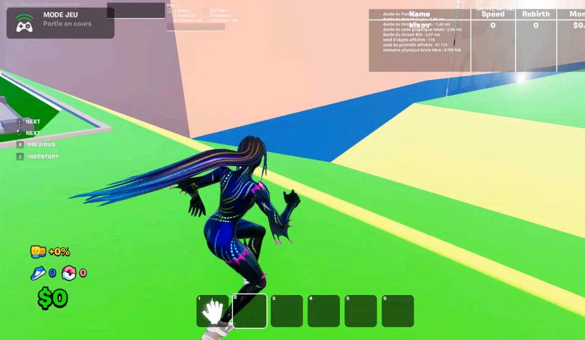
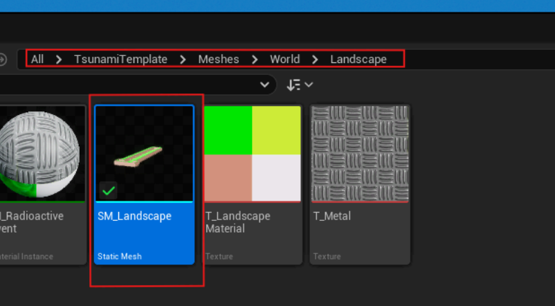
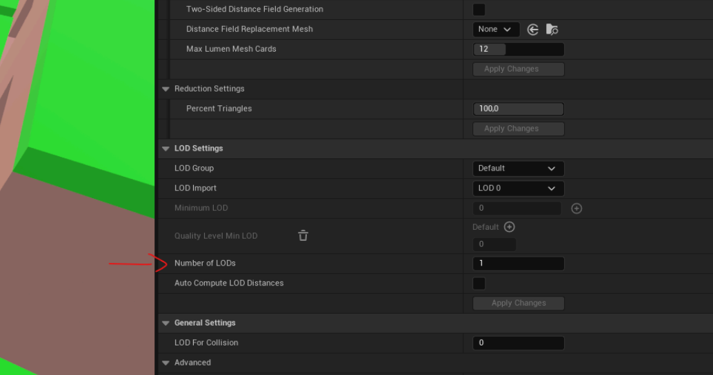
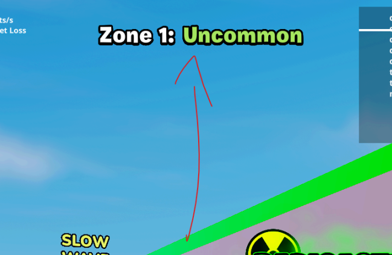
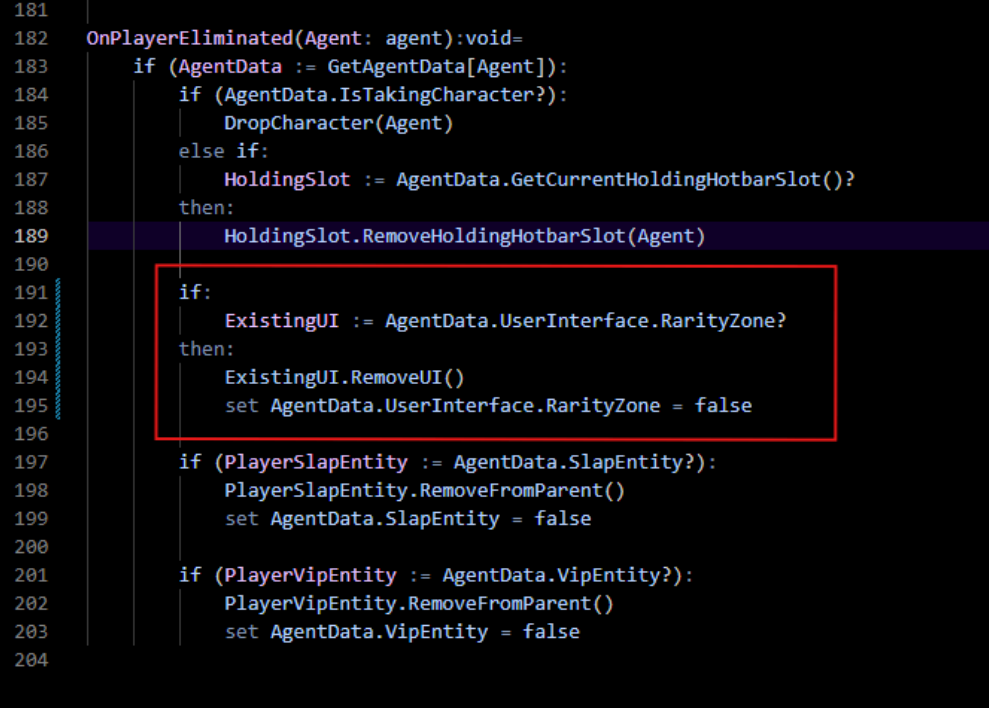
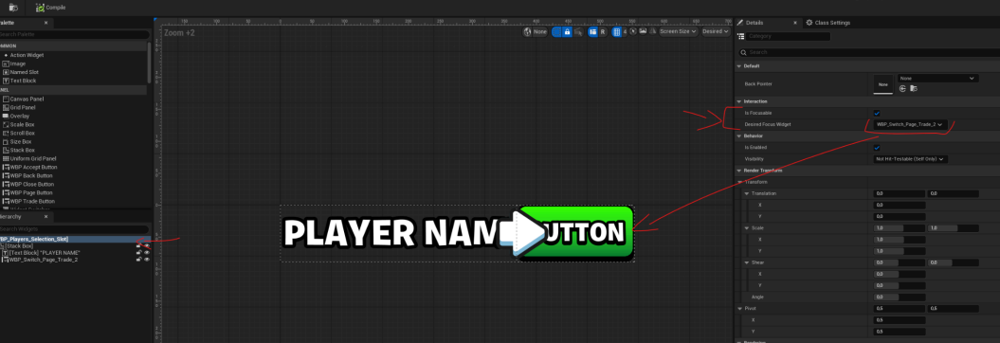
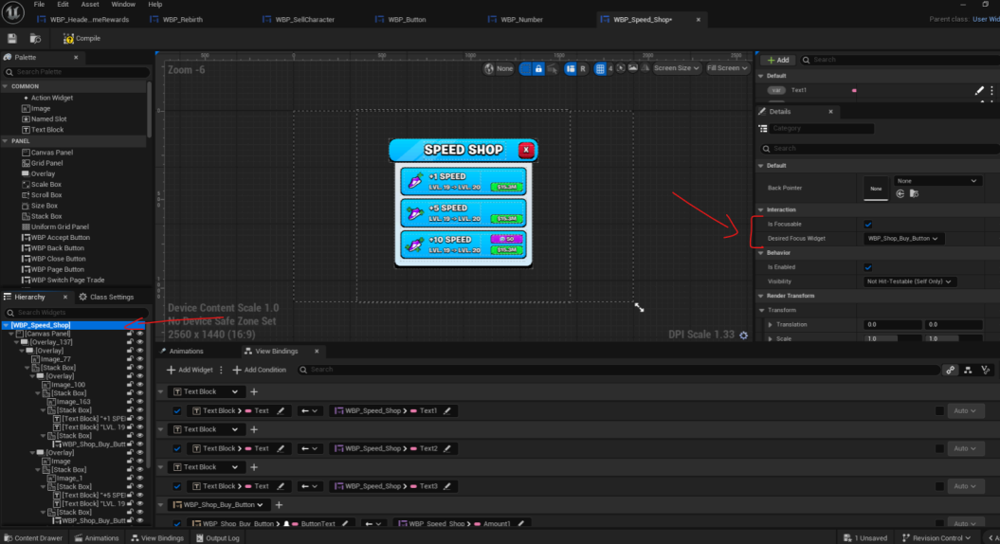

# V1.1 Update
Fixes:
- Incorrect landscape mesh LOD
- Rarity zone text not getting removed
- Controller UI

## Incorrect landscape mesh LOD
 
To fix this, simply open the SM_Landscape and set the number of LODs to 1. Then click the `Apply Changes` button below it.

 

## Rarity zone text not getting removed
 
There was a bug where, when a player died while in the zone to recover characters, the zone rarity text remained on the screen. To fix this, simply go to `spawn_manager.verse` and
add the following to the `OnPlayerEliminated()` function.

## Controller UI
To fix the accessibility of custom UI buttons for controllers. To do this, simply select the WBP in
question and enable the IsFocusable option. Below this parameter, you can choose which button or focus will be applied when the UI is activated for controller players.

Here are some examples;

